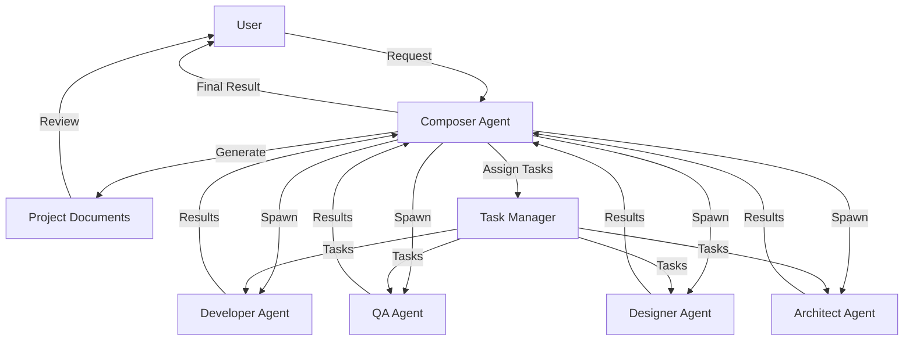

# Design Document

## Overview

The Claude Code Multi-Agent Framework is designed to orchestrate multiple AI agents working collaboratively on software development tasks. The system follows a hub-and-spoke architecture with a central Composer Agent coordinating multiple specialized Sub-Agents, each running in its own terminal. This design enables parallel execution of tasks while maintaining proper coordination and dependency management.

## Architecture

### High-Level Architecture

The framework follows a hierarchical architecture with the following components:



### Process Flow

1. User initiates the process by providing a project description
2. Composer Agent generates project documentation (requirements, design, tasks)
3. User reviews and approves the documentation
4. Composer Agent spawns Sub-Agents in separate terminals
5. Task Manager assigns tasks to appropriate Sub-Agents based on dependencies
6. Sub-Agents execute their tasks and report results back to the Composer Agent
7. Composer Agent aggregates results and provides a final summary to the user

## Terminal Management

### Terminal Process Architecture

The framework implements a sophisticated terminal management system that enables true parallel execution of Sub-Agents in separate terminal sessions:

#### Terminal Spawning Strategy

```python
class TerminalManager:
    def __init__(self, workspace: str)
    async def spawn_agent_terminal(self, agent_name: str, port: int) -> subprocess.Popen
    async def monitor_terminal_health(self, process: subprocess.Popen) -> bool
    async def cleanup_terminals(self) -> None
```

**Terminal Spawning Process:**
1. Each Sub-Agent is launched in a dedicated terminal using `subprocess.Popen`
2. Terminals are configured with appropriate environment variables and workspace paths
3. Agent processes are monitored for health and responsiveness
4. Terminal cleanup is performed on shutdown or failure

#### Platform-Specific Terminal Handling

**Linux/macOS:**
```bash
# Terminal spawning command
gnome-terminal --tab --title="Agent-{name}" -- python -m multi_agent_framework.sub_agent --name {name} --port {port}
```

**Windows:**
```cmd
# Terminal spawning command
start "Agent-{name}" cmd /k python -m multi_agent_framework.sub_agent --name {name} --port {port}
```

#### Terminal Session Management

- **Session Isolation**: Each agent runs in its own process space with dedicated resources
- **Environment Configuration**: Agents inherit workspace configuration but maintain separate state
- **Resource Monitoring**: Terminal processes are monitored for memory and CPU usage
- **Graceful Shutdown**: Proper cleanup of terminal sessions and child processes

### Terminal Communication Protocol

Sub-Agents communicate with the Composer Agent while maintaining terminal independence:

```python
# Terminal startup sequence
async def start_terminal_session(self, agent_config: dict) -> dict:
    process = await self.spawn_agent_terminal(agent_config['name'], agent_config['port'])
    await self.wait_for_agent_ready(agent_config['port'])
    return {
        'process': process,
        'pid': process.pid,
        'port': agent_config['port'],
        'status': 'running'
    }
```

## Components and Interfaces

### Composer Agent

The Composer Agent is the central orchestrator responsible for:

- Generating project documentation
- Spawning and managing Sub-Agents
- Coordinating task assignment and execution
- Aggregating results and providing feedback

**Interface:**
```python
class ComposerAgent:
    def __init__(self, workspace: str, config_path: str = None, verbose: bool = False, no_confirm: bool = False)
    async def orchestrate(self, user_request: str) -> str
    async def generate_requirements_docs(self, user_request: str) -> None
    async def get_user_confirmation(self) -> bool
    async def spawn_sub_agents(self) -> None
    async def assign_and_monitor_tasks(self) -> None
```

### Sub-Agent

Sub-Agents are specialized agents responsible for executing specific types of tasks. Each agent has distinct capabilities, workflows, and specializations:

#### Developer Agent

**Primary Responsibilities:**
- Code implementation based on specifications
- Bug fixing and code refactoring
- Integration with existing codebases
- Code review and optimization

**Specialized Capabilities:**
```python
class DeveloperAgent(SubAgent):
    async def implement_feature(self, specification: dict) -> str
    async def fix_bug(self, bug_report: dict) -> str
    async def refactor_code(self, refactor_request: dict) -> str
    async def integrate_component(self, component_spec: dict) -> str
    async def optimize_performance(self, performance_target: dict) -> str
```

**Workflow Patterns:**
1. **Feature Implementation**: Specification → Code → Unit Tests → Integration
2. **Bug Fixing**: Bug Report → Root Cause Analysis → Fix → Verification
3. **Code Review**: Code Analysis → Suggestions → Refactoring → Optimization

**Tools and Integrations:**
- Code editors and IDEs
- Version control systems (Git)
- Code quality tools (linters, formatters)
- Testing frameworks
- CI/CD pipelines

#### QA Agent

**Primary Responsibilities:**
- Test case creation and execution
- Quality assurance and validation
- Performance testing
- Bug reporting and tracking

**Specialized Capabilities:**
```python
class QAAgent(SubAgent):
    async def create_test_suite(self, requirements: dict) -> str
    async def execute_tests(self, test_config: dict) -> dict
    async def performance_test(self, performance_spec: dict) -> dict
    async def validate_requirements(self, requirements: dict) -> dict
    async def report_bugs(self, test_results: dict) -> list
```

**Workflow Patterns:**
1. **Test Creation**: Requirements → Test Cases → Test Scripts → Test Data
2. **Test Execution**: Test Suite → Execution → Results → Bug Reports
3. **Validation**: Feature → Test → Verify → Sign-off

**Testing Types:**
- Unit testing
- Integration testing
- System testing
- Performance testing
- Security testing
- User acceptance testing

#### Designer Agent

**Primary Responsibilities:**
- UI/UX design creation
- Design system development
- User experience optimization
- Visual asset creation

**Specialized Capabilities:**
```python
class DesignerAgent(SubAgent):
    async def create_wireframes(self, requirements: dict) -> str
    async def design_ui_components(self, component_spec: dict) -> str
    async def create_design_system(self, brand_guidelines: dict) -> str
    async def optimize_user_experience(self, user_research: dict) -> str
    async def generate_visual_assets(self, asset_requirements: dict) -> str
```

**Workflow Patterns:**
1. **Design Process**: Research → Wireframes → Mockups → Prototypes → Final Design
2. **Component Design**: Requirements → Design → Iterations → Specifications
3. **User Experience**: User Research → Journey Mapping → Design → Testing → Iteration

**Design Deliverables:**
- Wireframes and mockups
- UI component specifications
- Design system documentation
- Interactive prototypes
- Visual assets and icons

#### Architect Agent

**Primary Responsibilities:**
- System architecture design
- Component structure planning
- Technology stack selection
- Scalability and performance planning

**Specialized Capabilities:**
```python
class ArchitectAgent(SubAgent):
    async def design_system_architecture(self, requirements: dict) -> str
    async def select_technology_stack(self, project_constraints: dict) -> dict
    async def plan_component_structure(self, feature_requirements: dict) -> str
    async def design_data_models(self, data_requirements: dict) -> str
    async def plan_scalability(self, growth_projections: dict) -> str
```

**Workflow Patterns:**
1. **Architecture Design**: Requirements → Analysis → Design → Documentation → Review
2. **Technology Selection**: Constraints → Options → Evaluation → Selection → Justification
3. **Component Planning**: Features → Structure → Interfaces → Dependencies → Documentation

**Architecture Deliverables:**
- System architecture diagrams
- Component interaction diagrams
- Database schema designs
- API specifications
- Technology stack recommendations
- Scalability and performance plans

**Interface:**
```python
class SubAgent:
    def __init__(self, name: str, role: str, port: int, workspace: str)
    async def start(self) -> None
    async def execute_task(self, task: dict) -> dict
    async def claude_code_execute(self, task: dict) -> str
```

### Task Manager

The Task Manager handles task assignment, dependency resolution, and execution tracking:

- Loads tasks from the task list
- Resolves dependencies between tasks
- Assigns tasks to appropriate agents
- Tracks task execution status

**Interface:**
```python
class TaskManager:
    def __init__(self, composer_agent: ComposerAgent)
    async def load_tasks_from_file(self) -> list
    def parse_tasks_markdown(self, content: str) -> list
    async def assign_tasks(self) -> None
    def sort_tasks_by_dependencies(self) -> list
    async def send_task_to_agent(self, agent_name: str, task: dict) -> None
```

### Communication Protocol

Sub-Agents communicate with the Composer Agent via HTTP:

- Each Sub-Agent runs an HTTP server on a designated port
- The Composer Agent sends task assignments via HTTP POST requests
- Sub-Agents report task status and results via HTTP responses
- Health checks are performed via HTTP GET requests

## Real-time Monitoring System

### Monitoring Architecture

The framework implements a comprehensive real-time monitoring system that provides visibility into agent activities, task progress, and system health:

```python
class MonitoringSystem:
    def __init__(self, composer_agent: ComposerAgent)
    async def start_monitoring(self) -> None
    async def collect_agent_metrics(self) -> dict
    async def track_task_progress(self) -> dict
    async def monitor_system_health(self) -> dict
    async def generate_real_time_dashboard(self) -> str
```

### Multi-Terminal Monitoring

#### Terminal Dashboard Layout

The monitoring system provides a multi-pane terminal dashboard:

```
┌─────────────────────────────────────────────────────────────────────────────────┐
│                           Multi-Agent Framework Monitor                         │
├─────────────────────────────────────────────────────────────────────────────────┤
│ System Status: RUNNING | Active Agents: 4/4 | Tasks: 12 total, 3 done, 2 active│
├─────────────────────────────────────────────────────────────────────────────────┤
│ Agent Status                    │ Task Progress                                  │
├─────────────────────────────────┼────────────────────────────────────────────────┤
│ 🟢 Developer  [Port:8001] ACTIVE│ [██████████████████████████████████████] 75%   │
│   Current: implement_user_auth  │ implement_user_auth        [Developer] ACTIVE │
│   Queue: 2 tasks               │ create_login_tests         [QA]       PENDING │
│                                │ design_auth_ui             [Designer] PENDING │
│ 🟢 QA         [Port:8002] IDLE  │ setup_database            [Architect] DONE   │
│   Current: waiting             │                                               │
│   Queue: 3 tasks               │                                               │
│                                │                                               │
│ 🟢 Designer   [Port:8003] ACTIVE│ Recent Activity                               │
│   Current: create_wireframes   │ 14:30:15 Developer: Started user auth impl    │
│   Queue: 1 task                │ 14:29:45 QA: Completed database tests        │
│                                │ 14:28:12 Designer: Finished wireframes       │
│ 🟢 Architect  [Port:8004] IDLE  │ 14:27:33 Architect: Database schema ready    │
│   Current: waiting             │                                               │
│   Queue: 0 tasks               │                                               │
└─────────────────────────────────┴────────────────────────────────────────────────┘
```

#### Live Agent Terminal Monitoring

Each agent terminal displays real-time activity:

**Developer Agent Terminal:**
```
[Developer Agent - Port 8001] ━━━━━━━━━━━━━━━━━━━━━━━━━━━━━━━━━━━━━━━━━━━━━━━━━━━━━━━
Status: ACTIVE | Current Task: implement_user_auth | Progress: 45%

[14:30:15] 🚀 Starting task: implement_user_auth
[14:30:16] 📂 Analyzing existing codebase structure
[14:30:18] 🔍 Reviewing authentication requirements
[14:30:20] ⚙️  Setting up authentication middleware
[14:30:22] 🔧 Implementing user model and database schema
[14:30:25] 🧪 Running preliminary tests
[14:30:27] ✅ User registration endpoint complete
[14:30:29] 🔄 Working on login functionality...

Queue: 2 tasks pending
- fix_validation_bug (Priority: High)
- optimize_database_queries (Priority: Medium)
```

**QA Agent Terminal:**
```
[QA Agent - Port 8002] ━━━━━━━━━━━━━━━━━━━━━━━━━━━━━━━━━━━━━━━━━━━━━━━━━━━━━━━━━━━━━━━
Status: IDLE | Last Task: database_tests | Completed: 14:29:45

[14:29:30] 🧪 Starting database tests
[14:29:32] ✅ Connection tests passed
[14:29:35] ✅ CRUD operations tests passed
[14:29:38] ✅ Data validation tests passed
[14:29:42] ✅ Performance tests passed
[14:29:45] 🎉 All database tests completed successfully

Waiting for next task assignment...
Next in queue: create_login_tests (waiting for developer completion)
```

### Monitoring Features

#### Real-time Metrics Collection

```python
class MetricsCollector:
    async def collect_performance_metrics(self) -> dict:
        return {
            "cpu_usage": self.get_cpu_usage(),
            "memory_usage": self.get_memory_usage(),
            "task_completion_rate": self.calculate_completion_rate(),
            "agent_response_time": self.measure_response_times(),
            "error_rate": self.calculate_error_rate()
        }
    
    async def collect_task_metrics(self) -> dict:
        return {
            "total_tasks": self.count_total_tasks(),
            "completed_tasks": self.count_completed_tasks(),
            "active_tasks": self.count_active_tasks(),
            "failed_tasks": self.count_failed_tasks(),
            "average_completion_time": self.calculate_avg_completion_time()
        }
```

#### Health Monitoring

```python
class HealthMonitor:
    async def check_agent_health(self, agent_name: str) -> dict:
        return {
            "status": "healthy|degraded|unhealthy",
            "response_time": float,
            "last_heartbeat": datetime,
            "error_count": int,
            "resource_usage": {
                "cpu": float,
                "memory": float,
                "disk": float
            }
        }
    
    async def monitor_system_resources(self) -> dict:
        return {
            "system_load": self.get_system_load(),
            "available_memory": self.get_available_memory(),
            "disk_usage": self.get_disk_usage(),
            "network_status": self.check_network_connectivity()
        }
```

#### Alert System

```python
class AlertSystem:
    async def configure_alerts(self, alert_config: dict) -> None:
        """Configure monitoring alerts and thresholds"""
        pass
    
    async def send_alert(self, alert_type: str, message: str) -> None:
        """Send alerts via configured channels (email, slack, etc.)"""
        pass
    
    def check_thresholds(self, metrics: dict) -> list:
        """Check metrics against configured thresholds"""
        alerts = []
        if metrics['cpu_usage'] > 80:
            alerts.append({"type": "cpu_high", "message": "CPU usage above 80%"})
        if metrics['error_rate'] > 0.1:
            alerts.append({"type": "error_rate_high", "message": "Error rate above 10%"})
        return alerts
```

### Monitoring Commands

The CLI provides comprehensive monitoring commands:

```bash
# Start monitoring dashboard
multi-agent monitor --dashboard

# View specific agent logs
multi-agent monitor --agent developer --follow

# Check system health
multi-agent monitor --health

# View performance metrics
multi-agent monitor --metrics --interval 5

# Export monitoring data
multi-agent monitor --export --format json --output metrics.json
```

### Integration with External Tools

The monitoring system can integrate with popular monitoring tools:

- **Prometheus**: Export metrics for long-term storage
- **Grafana**: Create custom dashboards and visualizations
- **ELK Stack**: Centralized logging and log analysis
- **Datadog**: Cloud-based monitoring and alerting
- **Custom Webhooks**: Integration with existing monitoring infrastructure

## Data Models

### Task Model

```python
Task = {
    "title": str,           # Task title
    "description": str,     # Detailed description
    "agent": str,           # Target agent name
    "priority": int,        # Priority level (lower is higher priority)
    "dependencies": list,   # List of task titles this task depends on
    "status": str,          # "not_started", "in_progress", "completed", "failed"
    "result": Optional[str] # Task execution result
}
```

### Agent Status Model

```python
AgentStatus = {
    "name": str,            # Agent name
    "role": str,            # Agent role
    "status": str,          # "idle", "working", "completed", "error"
    "current_task": Optional[dict]  # Current task being executed
}
```

### Configuration Model

```yaml
# Agent configuration
agents:
  developer:
    role: "code_implementation"
    max_parallel_tasks: 3
    timeout: 300
    retry_count: 2
  qa:
    role: "quality_assurance"
    max_parallel_tasks: 2
    timeout: 180
    retry_count: 1
  # Additional agents...

# Task type configuration
task_types:
  requirements_analysis:
    agent: "architect"
    priority: 1
    dependencies: []
  # Additional task types...
```

## Error Handling

The framework implements a comprehensive error handling strategy at multiple levels:

### Task-Level Error Handling

- Retry mechanism with exponential backoff
- Task timeout limits to prevent hanging
- Fallback mechanisms to reassign failed tasks

### Agent-Level Error Handling

- Health check monitoring to detect unresponsive agents
- Automatic agent restart on failure
- State persistence to recover from crashes

### System-Level Error Handling

- Structured logging for debugging
- Error aggregation and reporting
- Graceful shutdown on critical failures

## Testing Strategy

### Unit Testing

- Test individual components in isolation
- Mock dependencies for controlled testing
- Focus on core functionality:
  - Task parsing and dependency resolution
  - Agent communication protocol
  - Error handling mechanisms

### Integration Testing

- Test interaction between components
- Verify end-to-end workflows
- Test scenarios:
  - Document generation and approval
  - Agent spawning and communication
  - Task assignment and execution

### System Testing

- Test the complete system in a realistic environment
- Verify parallel execution capabilities
- Test error recovery mechanisms
- Measure performance and resource usage

## Deployment Strategy

### Package Distribution

#### PyPI Package Structure

The framework follows standard Python package distribution practices:

```
multi-agent-framework/
├── multi_agent_framework/
│   ├── __init__.py
│   ├── composer/
│   │   ├── __init__.py
│   │   ├── agent.py
│   │   └── orchestrator.py
│   ├── sub_agents/
│   │   ├── __init__.py
│   │   ├── base.py
│   │   ├── developer.py
│   │   ├── qa.py
│   │   ├── designer.py
│   │   └── architect.py
│   ├── task_manager/
│   │   ├── __init__.py
│   │   ├── manager.py
│   │   └── dependencies.py
│   ├── terminal/
│   │   ├── __init__.py
│   │   ├── manager.py
│   │   └── monitor.py
│   ├── cli/
│   │   ├── __init__.py
│   │   ├── main.py
│   │   └── commands.py
│   └── config/
│       ├── __init__.py
│       ├── loader.py
│       └── validator.py
├── tests/
├── docs/
├── examples/
├── setup.py
├── pyproject.toml
├── requirements.txt
├── README.md
└── CHANGELOG.md
```

#### Installation Requirements

**System Requirements:**
- Python 3.9 or higher
- Operating System: Linux, macOS, or Windows
- Memory: Minimum 2GB RAM (4GB recommended)
- Disk Space: 100MB for framework + project workspace

**Required Dependencies:**
```toml
[project]
dependencies = [
    "aiohttp>=3.8.0",
    "pyyaml>=6.0",
    "click>=8.0.0",
    "rich>=13.0.0",
    "psutil>=5.9.0",
    "asyncio-mqtt>=0.13.0",
    "websockets>=11.0.0",
    "jinja2>=3.1.0",
    "python-dotenv>=1.0.0"
]
```

**Optional Dependencies:**
```toml
[project.optional-dependencies]
monitoring = ["prometheus-client>=0.16.0", "grafana-api>=1.0.3"]
development = ["pytest>=7.0.0", "black>=22.0.0", "mypy>=1.0.0"]
docs = ["sphinx>=5.0.0", "sphinx-rtd-theme>=1.2.0"]
```

#### Installation Procedures

**Standard Installation:**
```bash
# Install from PyPI
pip install multi-agent-framework

# Verify installation
multi-agent --version

# Initialize default configuration
multi-agent config --init
```

**Development Installation:**
```bash
# Clone repository
git clone https://github.com/anthropic/multi-agent-framework.git
cd multi-agent-framework

# Install in development mode
pip install -e .[development]

# Run tests
pytest tests/

# Install pre-commit hooks
pre-commit install
```

**Virtual Environment Setup:**
```bash
# Create virtual environment
python -m venv multi-agent-env

# Activate environment
source multi-agent-env/bin/activate  # Linux/macOS
multi-agent-env\Scripts\activate     # Windows

# Install framework
pip install multi-agent-framework
```

#### Setup and Initialization

**First-time Setup:**
```bash
# Create project workspace
mkdir my-project
cd my-project

# Initialize framework in workspace
multi-agent init

# This creates:
# - .multi-agent/
#   ├── config.yaml
#   ├── agents/
#   ├── logs/
#   └── workspace/
```

**Configuration Validation:**
```bash
# Validate configuration
multi-agent config --validate

# Output example:
# ✅ Configuration valid
# ✅ All required sections present
# ✅ Agent configurations valid
# ✅ Task type definitions valid
# ⚠️  Warning: No custom agents defined
```

**Quick Start Example:**
```bash
# Start with a simple project
multi-agent start "Create a simple REST API with user authentication" \
    --workspace ./my-api \
    --agents developer,qa,architect

# Monitor progress
multi-agent monitor --dashboard
```

#### Documentation Structure

**User Documentation:**
- **Quick Start Guide**: Basic setup and first project
- **User Manual**: Comprehensive usage instructions
- **CLI Reference**: Complete command documentation
- **Configuration Guide**: Detailed configuration options
- **Examples**: Common use cases and patterns

**Developer Documentation:**
- **API Reference**: Complete API documentation
- **Architecture Guide**: System design and components
- **Contributing Guide**: Development setup and guidelines
- **Plugin Development**: Creating custom agents and extensions

**Troubleshooting:**
- **Common Issues**: FAQ and solutions
- **Error Messages**: Detailed error explanations
- **Performance Tuning**: Optimization guidelines
- **Platform-specific Notes**: OS-specific considerations

#### Upgrade and Migration

**Upgrade Process:**
```bash
# Check current version
multi-agent --version

# Upgrade to latest version
pip install --upgrade multi-agent-framework

# Migrate configuration if needed
multi-agent config --migrate

# Verify upgrade
multi-agent config --validate
```

**Version Compatibility:**
- **Breaking Changes**: Documented in CHANGELOG.md
- **Migration Tools**: Automatic configuration migration
- **Backwards Compatibility**: Maintained for minor versions
- **Deprecation Warnings**: 2-version deprecation policy

### Configuration Management

#### Configuration Architecture

The framework uses a hierarchical configuration system that supports multiple sources and runtime overrides:

```python
class ConfigurationManager:
    def __init__(self, workspace: str = None)
    def load_configuration(self, config_path: str = None) -> dict
    def validate_configuration(self, config: dict) -> ValidationResult
    def apply_runtime_overrides(self, overrides: dict) -> None
    def get_effective_configuration(self) -> dict
    def save_configuration(self, config: dict, path: str) -> None
```

#### Configuration Hierarchy

Configuration is loaded in the following order (higher priority overrides lower):

1. **System Defaults** - Built-in framework defaults
2. **Global Configuration** - `~/.multi-agent/config.yaml`
3. **Project Configuration** - `<workspace>/.multi-agent/config.yaml`
4. **Environment Variables** - `MULTI_AGENT_*` variables
5. **Command Line Arguments** - CLI flags and options
6. **Runtime Overrides** - Programmatic configuration changes

#### Default Configuration Structure

```yaml
# Default configuration template
framework:
  version: "1.0.0"
  workspace: "."
  log_level: "INFO"
  max_agents: 8
  timeout: 300
  
# Agent configurations
agents:
  developer:
    role: "code_implementation"
    max_parallel_tasks: 3
    timeout: 300
    retry_count: 2
    capabilities:
      - "code_generation"
      - "bug_fixing"
      - "refactoring"
      - "testing"
    tools:
      - "git"
      - "pytest"
      - "black"
      - "mypy"
    
  qa:
    role: "quality_assurance"
    max_parallel_tasks: 2
    timeout: 180
    retry_count: 1
    capabilities:
      - "test_creation"
      - "test_execution"
      - "validation"
      - "reporting"
    tools:
      - "pytest"
      - "selenium"
      - "coverage"
      
  designer:
    role: "ui_ux_design"
    max_parallel_tasks: 1
    timeout: 240
    retry_count: 1
    capabilities:
      - "wireframe_creation"
      - "ui_design"
      - "ux_optimization"
      - "asset_generation"
    tools:
      - "figma"
      - "sketch"
      - "photoshop"
      
  architect:
    role: "system_design"
    max_parallel_tasks: 2
    timeout: 360
    retry_count: 2
    capabilities:
      - "architecture_design"
      - "technology_selection"
      - "component_planning"
      - "scalability_planning"
    tools:
      - "draw.io"
      - "mermaid"
      - "plantuml"

# Task type configurations
task_types:
  requirements_analysis:
    agent: "architect"
    priority: 1
    estimated_duration: 60
    dependencies: []
    
  system_design:
    agent: "architect"
    priority: 2
    estimated_duration: 120
    dependencies: ["requirements_analysis"]
    
  implementation:
    agent: "developer"
    priority: 3
    estimated_duration: 180
    dependencies: ["system_design"]
    
  testing:
    agent: "qa"
    priority: 4
    estimated_duration: 90
    dependencies: ["implementation"]
    
  ui_design:
    agent: "designer"
    priority: 3
    estimated_duration: 150
    dependencies: ["requirements_analysis"]

# Communication settings
communication:
  protocol: "http"
  base_port: 8000
  port_range: 100
  health_check_interval: 30
  heartbeat_timeout: 10
  
# Monitoring settings
monitoring:
  enabled: true
  dashboard_port: 9000
  metrics_collection_interval: 5
  log_aggregation: true
  alerting:
    enabled: true
    channels:
      - "console"
      - "file"
    thresholds:
      cpu_usage: 80
      memory_usage: 75
      error_rate: 0.1
      
# Security settings
security:
  authentication:
    enabled: false
    method: "token"
  authorization:
    enabled: false
    rbac: false
  encryption:
    enabled: false
    algorithm: "AES256"
```

#### Runtime Configuration Overrides

**Environment Variables:**
```bash
# Framework settings
export MULTI_AGENT_WORKSPACE="/custom/workspace"
export MULTI_AGENT_LOG_LEVEL="DEBUG"
export MULTI_AGENT_MAX_AGENTS="4"

# Agent settings
export MULTI_AGENT_DEVELOPER_TIMEOUT="600"
export MULTI_AGENT_QA_MAX_PARALLEL="1"

# Communication settings
export MULTI_AGENT_BASE_PORT="9000"
export MULTI_AGENT_PROTOCOL="https"
```

**Command Line Overrides:**
```bash
# Override agent configurations
multi-agent start "Project description" \
    --agents developer,qa \
    --developer-timeout 600 \
    --qa-max-parallel 1 \
    --base-port 9000

# Override monitoring settings
multi-agent start "Project description" \
    --no-monitoring \
    --log-level DEBUG \
    --timeout 1800
```

**Programmatic Overrides:**
```python
# Runtime configuration override
composer = ComposerAgent(workspace="./project")
composer.override_config({
    "agents.developer.max_parallel_tasks": 5,
    "monitoring.enabled": False,
    "communication.base_port": 9000
})
```

#### Advanced Customization

**Custom Agent Types:**
```yaml
# Custom agent definition
agents:
  custom_security_agent:
    role: "security_analysis"
    max_parallel_tasks: 1
    timeout: 180
    retry_count: 2
    capabilities:
      - "vulnerability_scanning"
      - "security_review"
      - "penetration_testing"
    tools:
      - "bandit"
      - "safety"
      - "nmap"
    custom_config:
      scan_depth: "deep"
      report_format: "json"
```

**Environment-Specific Configurations:**
```yaml
# Development environment
development:
  framework:
    log_level: "DEBUG"
    timeout: 600
  monitoring:
    enabled: true
    dashboard_port: 9000
    
# Production environment  
production:
  framework:
    log_level: "INFO"
    timeout: 300
  monitoring:
    enabled: true
    dashboard_port: 8080
  security:
    authentication:
      enabled: true
    encryption:
      enabled: true
```

**Configuration Validation:**
```python
class ConfigValidator:
    def validate_agent_config(self, config: dict) -> ValidationResult
    def validate_task_types(self, config: dict) -> ValidationResult
    def validate_communication_settings(self, config: dict) -> ValidationResult
    def validate_security_settings(self, config: dict) -> ValidationResult
    
    def generate_validation_report(self, config: dict) -> ValidationReport:
        return ValidationReport(
            valid=True,
            warnings=["Custom agent 'security_agent' not officially supported"],
            errors=[],
            suggestions=["Consider using standard agent types for better support"]
        )
```

### Continuous Integration

- Implement GitHub Actions workflows
- Run tests on multiple Python versions
- Check code style and type annotations
- Build and publish packages automatically

## Command Line Interface Design

### CLI Architecture

The framework provides a comprehensive command-line interface that serves as the primary entry point for users:

```python
class CLIManager:
    def __init__(self)
    def parse_arguments(self, args: list) -> argparse.Namespace
    async def execute_command(self, command: str, args: dict) -> None
    def display_help(self) -> None
```

### Core CLI Commands

#### Primary Commands

**`multi-agent start`** - Initialize and start the multi-agent framework
```bash
multi-agent start "Build a web application with user authentication" \
    --workspace /path/to/project \
    --config custom_config.yaml \
    --verbose \
    --no-confirm
```

**`multi-agent status`** - Check the status of running agents
```bash
multi-agent status --workspace /path/to/project
```

**`multi-agent stop`** - Stop all running agents
```bash
multi-agent stop --workspace /path/to/project --force
```

#### Configuration Commands

**`multi-agent config`** - Manage framework configuration
```bash
multi-agent config --init                    # Initialize default config
multi-agent config --validate config.yaml   # Validate configuration
multi-agent config --show                    # Show current configuration
```

**`multi-agent agents`** - Manage agent configurations
```bash
multi-agent agents --list                    # List available agents
multi-agent agents --add custom_agent.yaml  # Add custom agent
multi-agent agents --remove developer       # Remove agent type
```

#### Monitoring Commands

**`multi-agent logs`** - View agent logs
```bash
multi-agent logs --agent developer --tail 50
multi-agent logs --all --since 1h
```

**`multi-agent tasks`** - View and manage tasks
```bash
multi-agent tasks --list                     # List all tasks
multi-agent tasks --status completed         # Filter by status
multi-agent tasks --agent qa                 # Filter by agent
```

### CLI Options and Flags

#### Global Options
```
--workspace, -w        Specify workspace directory (default: current directory)
--config, -c          Path to configuration file
--verbose, -v         Enable verbose output
--quiet, -q           Suppress non-essential output
--no-confirm         Skip confirmation prompts
--help, -h           Show help message
```

#### Command-Specific Options
```
start:
  --agents             Comma-separated list of agents to spawn
  --max-parallel       Maximum parallel tasks per agent
  --timeout            Task timeout in seconds
  
status:
  --json              Output in JSON format
  --refresh           Auto-refresh interval in seconds
  
logs:
  --tail              Number of lines to show
  --follow, -f        Follow log output
  --since             Show logs since timestamp
```

### Interactive Mode

The CLI supports an interactive mode for complex operations:

```bash
multi-agent interactive
```

**Interactive Commands:**
- `help` - Show available commands
- `spawn <agent_type>` - Spawn a new agent
- `assign <task_id> <agent_name>` - Assign task to agent
- `monitor` - Enter monitoring mode
- `exit` - Exit interactive mode

### Output Formatting

#### Standard Output Format
```
[2024-01-15 14:30:15] INFO: Composer Agent started
[2024-01-15 14:30:16] INFO: Spawning Developer Agent on port 8001
[2024-01-15 14:30:17] INFO: Spawning QA Agent on port 8002
[2024-01-15 14:30:18] INFO: All agents ready, starting task assignment
```

#### JSON Output Format
```json
{
  "timestamp": "2024-01-15T14:30:15Z",
  "agents": [
    {
      "name": "developer",
      "status": "running",
      "port": 8001,
      "current_task": "implement_user_auth"
    }
  ],
  "tasks": {
    "total": 12,
    "completed": 3,
    "in_progress": 2,
    "pending": 7
  }
}
```

### Error Handling and User Feedback

#### Error Messages
- Clear, actionable error messages with suggested solutions
- Color-coded output for better readability
- Progress indicators for long-running operations
- Graceful handling of interruptions (Ctrl+C)

#### User Confirmation Prompts
```
Generated project documents. Review files:
  - requirements.md
  - design.md  
  - tasks.md

Do you want to proceed with agent spawning? [y/N]:
```

## Security Considerations

- Validate all user inputs
- Implement proper error handling to prevent information leakage
- Use secure communication between agents
- Sanitize command execution to prevent injection attacks
- Implement proper permission handling for file operations